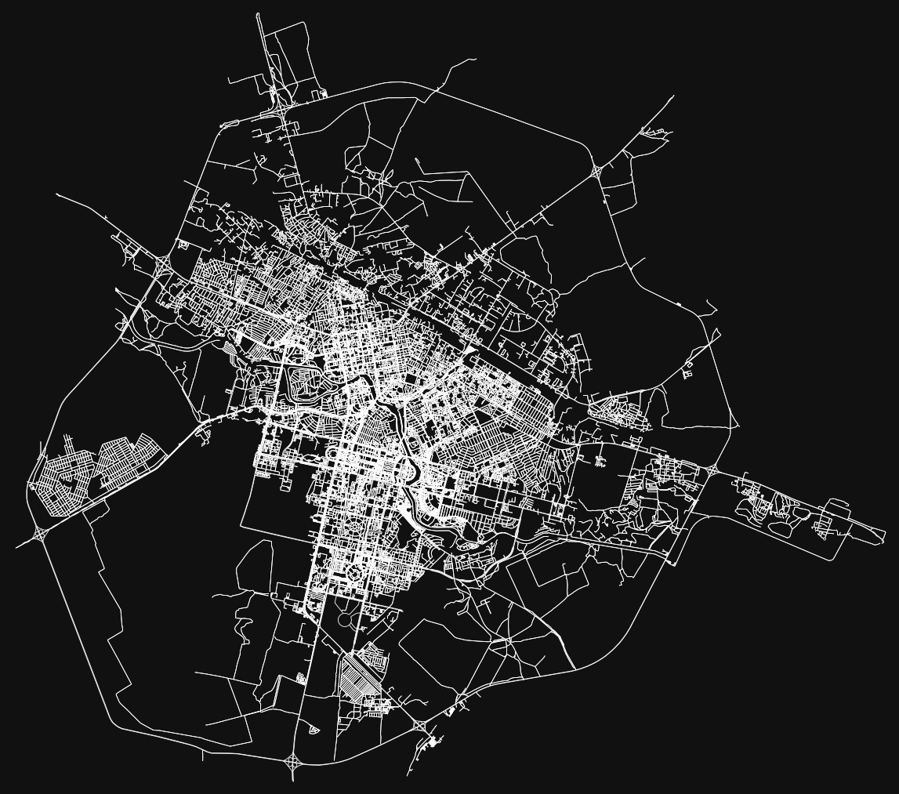

# OSM
## Содержание

- [Теория](#Теория)
- [Использование](#installation)
  - [Получение графа дорог с помощью OSMnx](#Получение-графа-дорог-с-помощью-OSMnx)
  - [Получение объектов с помощью OSMnx](#Получение-объектов-с-помощью-OSMnx)
  - [Построение маршрута и расчет расстояния с помощью OSMnx](#Построение-маршрута-и-расчет-расстояния-с-помощью-OSMnx)
- [Usage](#usage)
- [Contributing](#contributing)
- [License](#license)

## Теория

### OpenStreetMap

OpenStreetMap (OSM) - Некоммерческий веб-картографический проект по созданию силами сообщества участников - пользователей Интернета подробной свободной и бесплатной географической карты мира.

- Сайт: [OpenStreetMap](https://www.openstreetmap.org/)

### Overpass API

Overpass API - это API только для чтения, предоставляющее доступ к базе данных OpenStreetMap. Оно позволяет пользователям выполнять запросы и извлекать конкретные географические данные из OSM на основе различных критериев, таких как местоположение, теги и свойства. Overpass API - мощный инструмент для получения данных OSM, отвечающих определенным требованиям.

- Сайт: [Overpass API](https://wiki.openstreetmap.org/wiki/Overpass_API)

### Overpass Turbo

Overpass Turbo - это веб-инструмент, предоставляющий пользовательский интерфейс для взаимодействия с Overpass API. Он позволяет пользователям создавать и выполнять запросы к данным OSM, визуализировать результаты на интерактивной карте и экспортировать данные в различных форматах. Overpass Turbo vereinfacht den Prozess der Exploration und Extraktion von OSM-Daten für unterschiedliche Zwecke.

- Сайт: [Overpass Turbo](https://overpass-turbo.eu/)

### Хранение геоданных

OpenStreetMap, Overpass API и Overpass Turbo хранят геоданные с использованием специализированной модели данных, называемой моделью данных OpenStreetMap. Географические данные в OSM представлены в виде узлов (nodes), линий (ways) и отношений (relations). Узлы представляют отдельные точки с координатами, линии представляют линейные объекты, такие как дороги и реки, а отношения представляют собой коллекции узлов, линий и других отношений для представления сложных или многофункциональных объектов.

Геоданные в OpenStreetMap хранятся в распределенной форме на нескольких серверах и организованы в иерархическую структуру, называемую сеткой тайлов. Каждый тайл содержит определенную область карты и связан с уникальным идентификатором. Эта структура позволяет эффективно хранить, извлекать и отображать геоданные для различных картографических приложений.

### OSMnx

OSMnx - это библиотека на языке Python, позволяющая получать, анализировать и визуализировать данные OpenStreetMap. Она предоставляет простой в использовании интерфейс для загрузки данных OSM для конкретных регионов, создания графов сети на основе дорожных данных и выполнения различных задач анализа сети. OSMnx особенно полезен для градостроителей, исследователей и разработчиков, работающих с пространственными и транспортными данными.

- Документация: [OSMnx](https://osmnx.readthedocs.io/en/stable/index.html)

### NetworkX (NX)

NetworkX (NX) - это библиотека на языке Python для создания, манипулирования и изучения структуры, динамики и функций комплексных сетей. Она предоставляет широкий набор инструментов и алгоритмов для анализа сетей, включая меры центральности, анализ связности и поиск пути. NX может использоваться совместно с OSMnx для анализа и обработки графов сети, извлеченных из OpenStreetMap.


## Использование

Описание всех тегов open street map доступны по ссылке: [Map Features](https://wiki.openstreetmap.org/wiki/Map_features). 

### Получение графа дорог с помощью OSMnx

Убедитесь, что у вас установлены следующие пакеты `osmnx`,`networkx`, `matplotlib` в вашей среде Python (`pip install osmnx networkx matplotlib`). <br>

Параметр `network_type`: определяет тип дорожной сети для извлечения. Некоторые доступные значения включают `all` (все типы дорог), `walk` (только пешеходные дорожки), `bike` (только велосипедные дорожки), `drive` (только дороги для автомобилей), `drive_service` (только служебные проезды: внутриквартальные, въездные, парковочные )

> **Примечание:** `walk`, `bike` отображают все типы дорог почему-то все равно (так что нужно провести дополнительную фильтрацию, если нужно вытащить только пешеходный дорожный граф)

```python
import osmnx as ox
import networkx as nx
import matplotlib.pyplot as plt

# Указываем местоположение для получения графа дорог
place_name = "Nur-Sultan, Kazakhstan"

# Получаем граф дорог для указанного местоположения
graph = ox.graph_from_place(place_name, network_type='drive')
```

Фильтруем, чтобы получить только пешеходный дорожный граф:
```python
# Создайте копию графа (по желанию)
filtered_graph = graph.copy()

# Итерируйтесь по каждому ребру графа
for u, v, k, data in graph.edges(keys=True, data=True):
    # Проверьте тип дороги на пешеходные тропы
    if "footway" not in data["highway"] and "path" not in data["highway"]:
        # Если тип дороги не является пешеходной тропой, удаляем ребро из графа
        filtered_graph.remove_edge(u, v, k)
```

```python
# Отображаем ребра графа дорог (если хотите отобразить отфильтрованный, то graph замените на filtered_graph)
fig, ax = ox.plot_graph(graph, edge_color='white', edge_linewidth=0.5, node_size=0, show=False) 

# Показываем граф
plt.show()
```

Пример отображенного дорожного графа с `network_type="drive"` (только автомиобильные дороги):


Пример отображенного дорожного графа с `network_type="all"` (все типы дорог):


Пример отображенного пешеходного дорожного графа после фильтрации (только пешеходные):
")

### Получение объектов с помощью OSMnx

Для получения объектов, таких как парки, здания и другие достопримечательности, с помощью OSMnx выполните следующие шаги:

1. Убедитесь, что у вас установлен OSMnx в вашей среде Python (`pip install osmnx`).
2. Импортируйте библиотеку OSMnx в ваш скрипт Python или блокнот.
3. Используйте функцию `ox.pois_from_place()` для получения точек интереса (POI) для определенного места или области. Вы можете указать название города, границы полигона или точку с указанием радиуса для определения области.
4. Вы можете указать желаемые теги и удобства для фильтрации полученных точек интереса в соответствии с определенными критериями.
5. Функция вернет GeoDataFrame, содержащий запрошенные объекты, которые вы можете дальше анализировать или визуализировать.

Для более подробной документации и примеров обратитесь к [документации OSMnx](https://osmnx.readthedocs.io/).

### Построение маршрута и расчет расстояния с помощью OSMnx

Убедитесь, что у вас установлены следующие пакеты `osmnx`,`matplotlib` в вашей среде Python (`pip install osmnx matplotlib`).

```python
import osmnx as ox
import matplotlib.pyplot as plt

# Указываем местоположение для получения графа дорог
place_name = "Nur-Sultan, Kazakhstan"

# Создайте граф дорожной сети из OpenStreetMap данных
graph = ox.graph_from_place(place_name, network_type='drive') 

# Задайте координаты двух точек (широта и долгота)
point1 = ox.distance.nearest_nodes(graph, 71.4375894, 51.1247571)  # координаты в ввиде (x, y) долгота, широта
point2 = ox.distance.nearest_nodes(graph, 71.36435335414731, 51.19407083146049)  # координаты в ввиде (x, y) долгота, широта

# Добавьте геометрию (точки) на граф дорожной сети
ox.distance.add_edge_lengths(graph)

# Рассчитайте кратчайший путь и расстояние между точками
route = ox.distance.shortest_path(graph, point1, point2, weight='length')

# Получите длины ребер в маршруте и суммируйте их
distance = sum(ox.utils_graph.get_route_edge_attributes(graph, route, 'length'))

print(f'Расстояние между точкой 1 и точкой 2: {distance} метров')
```

Для отображения маршрута на графике с помощью matplotlib:
- убедитесь, что у вас установлены следующие пакеты `folium` в вашей среде Python (`pip install folium`)
- добавьте следующий код в ваш скрипт
```python
# Получите геометрию маршрута
route_geom = ox.plot_route_folium(graph, route=route, route_color='blue', route_width=4, edge_width=2)

# Построить граф дорожной сети и отобразить на нем маршрут
fig, ax = ox.plot_graph_route(graph, route, route_linewidth=4, node_size=0, bgcolor='w')

# Показать график
plt.show()
```
Пример отображенного маршрута между 2мя точками:


## Что почитать:
- https://osmnx.readthedocs.io/ - документация OSMnx
- https://wiki.openstreetmap.org/wiki/Map_features - описание всех тегов OSM
- https://habr.com/ru/articles/688556/ - чувак на Java работатет с OSM
